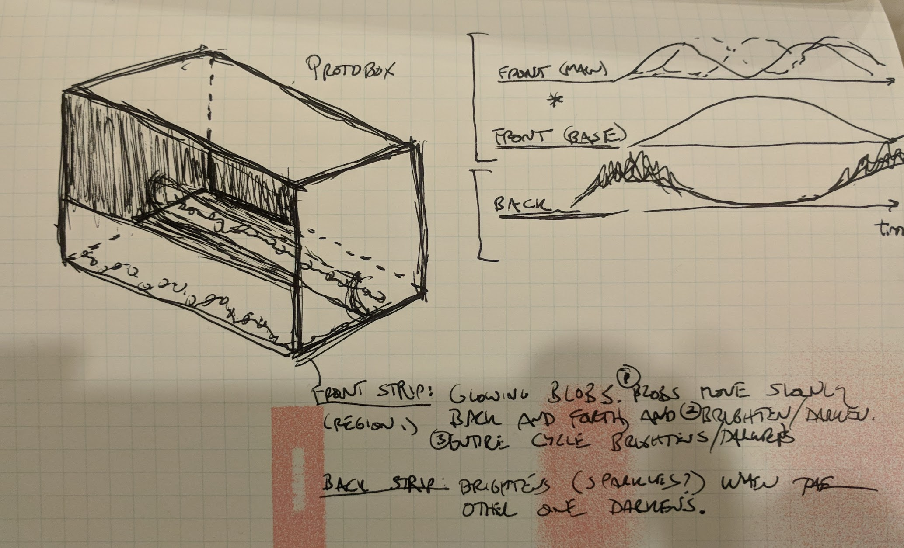
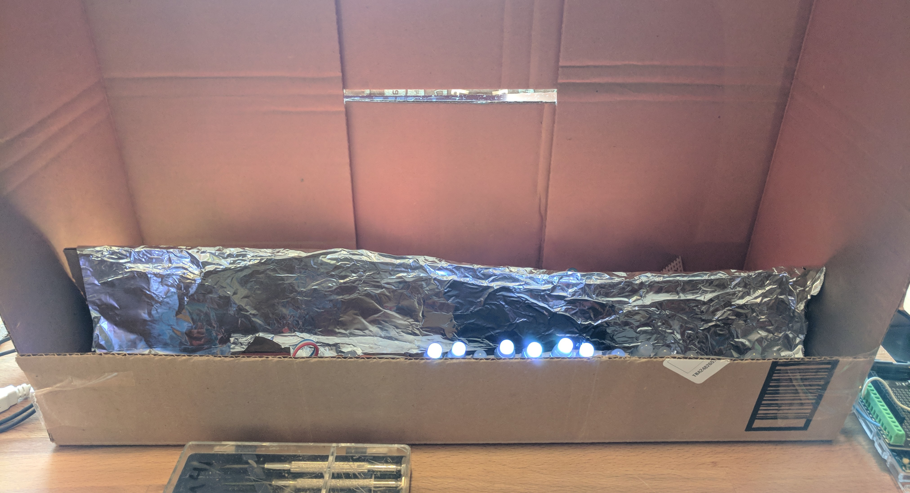

# storefront-lights
Arudino code for driving pixel strips for Sam Trout's October 2018 storefront installation.

## Repository branching strategy
* master: only for production code, always guaranteed to work
* develop: mostly-working code, but sometimes won't work.
* feature/my_feature: completely bleeding edge, no guarantees

## Repository structure
* ./arduino: most of the code
* ./images: project images
* ./documents: documentation and notes

## Key files
* ./arduino/storefront.ino: main arduino sketch for storefront
* ./arduino/packmatrix.ino: reference arduino sketch from backpack lights

# Initial Plan (9/13/18)
There will be one set of pixel strips wired together as a continuous line working in two banks, where the split point will be configurable.
* Bank 1: up against the window, this bank will have a slowly moving set of centroids, each of which will have a distribution of lights
around it, glowing and receding at its own pace. The overall set of these will be modulated by a slower moving wave.
* Bank 2: between the window objects and the trash wave, these lights will brighten as the first bank darkens, reaching a high brightness
with some random flashes. These may be of a red-orange tone to make it more ominous.

This sketch shows a prototype box and the rough time characteristic of the banks and patterns:

# First Implementation (9/16/18)
A first version is now working with both banks implemented.  The following features exist
* Overall multiglow cycle controls relative emphasis of bank 1 vs. bank 2.
* Bank 1 (spotlight blobs)
    * On for about 3/4 of the multiglow cycle. Peaks when Bank 2 is at its minimum.
    * Configurable number of "spotlight blobs" that indepedently glow/fade and move side to side
    * Spotlight brightness is modulated by individual blob cycle and overall multiglow cyle
    * Blob max velocity and cycle time can be adjusted, as can overall multiglow cycle
    * Blob color can vary as well, but currently this feature is not active, as the art will have its own color
* Bank 2 (fire)
    * Off for half the multiglow cycle. Peaks when Bank 1 is at its minimum
    * Brightness is modulated by multiglow cycle
    * Color for each pixel is full red and a random amount of green, which produces a range of yellows, oranges, and reds

An image is below; and a [video is here](https://www.facebook.com/sumitsumit/videos/vb.674565829/10157698258905830/?type=2&theater&notif_t=video_processed&notif_id=1537150678672915)

# Second Version (9/22/18)
An updated version is now finished, which both addresses the computate issues Josh was seeing with longer light strings, and also adds an IoT relay to control an external 120VAC lamp. 
* Bank 1 computation can be cut by a factor of N by setting BLOB_SUBSAMPLE. This only does the compute for every Nth pixel, then uses the same values for the next N-1 pixels.
* A [DLI IoT Relay](https://www.amazon.com/gp/product/B00WV7GMA2/ref=oh_aui_detailpage_o00_s00?ie=UTF8&psc=1) that can control 120VAC appliances (like Sam's lamp) has been added to the mix on output pin RELAY_PIN. It's controlled by functions lamp_on() and lamp_off()
* The fire sequence now includes activation of the relay at the peak of the cycle. In the video below it's controlling a desk lamp.

An [updated video is here](https://www.facebook.com/sumitsumit/videos/10157714445065830/).
